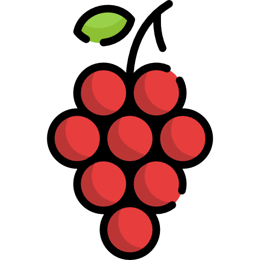

<div align="center">



# Kos Anggur Merah Dashboard

Manajemen kos (±60 kamar) – pantau sewa, denda, dan pengeluaran dalam satu halaman (mobile‑first).

</div>

## ✨ Fitur Utama

- Ringkasan Keuangan Bulanan: Sewa Ditagihkan, Sewa Terkumpul, Denda, Pengeluaran.
- Tabel Kamar: status pembayaran (otomatis), hari jatuh tempo, denda per kamar.
- CRUD: Kamar, Pembayaran, Denda, Pengeluaran (inline editing & toast feedback).
- Denda & Pengeluaran anchor jump (tombol cepat di mobile) untuk navigasi cepat.
- Ekspor: CSV, Excel, PDF ringkas (logo + KPI).
- Mobile-first UI (Tailwind) + tombol aksi besar di layar kecil.
- Seed SQL & script utilitas untuk pengisian data cepat.
- Tes unit untuk logika inti (summary & pembayaran).

## 📊 Definisi KPI (Business Rules)

| KPI             | Definisi                                                                                                |
| --------------- | ------------------------------------------------------------------------------------------------------- |
| Sewa Ditagihkan | Jumlah rent_price semua kamar berstatus occupied pada bulan dipilih (terlepas dari sudah bayar / belum) |
| Sewa Terkumpul  | Total amount_due dari pembayaran yang statusnya lunas (amount_paid >= amount_due)                       |
| Denda Terjadi   | Jumlah (count) insiden denda bulan itu                                                                  |
| Denda Terkumpul | Total amount denda yang sudah tercatat (kini ditampilkan terpisah dari sewa)                            |
| Pengeluaran     | Total nominal `expenses` bulan tersebut                                                                 |

Catatan: Perhitungan sewa tidak menjumlahkan denda. Denda dipantau sendiri agar transparan.

## 🧱 Arsitektur Singkat

Frontend SPA (Vite + React + TypeScript) langsung ke Supabase (Postgres + Auth). State pemanggilan data memakai TanStack Query. Styling Tailwind. PDF sederhana via jsPDF. Perhitungan summary bulanan dilakukan di sisi klien (room/payment/expense/penalty merge) – cukup untuk skala 60 kamar.

## 🛠️ Stack

- React 18 + Vite + TypeScript
- Tailwind CSS
- Supabase (Auth + Postgres)
- TanStack Query
- Vitest (unit tests)
- jsPDF (export PDF)

## 🚀 Mulai (Development)

1. Salin env: `cp .env.example .env`
2. Isi nilai:
   ```env
   VITE_SUPABASE_URL=...your-url...
   VITE_SUPABASE_ANON_KEY=...your-anon-key...
   ```
3. Install dependency: `npm install`
4. Jalankan dev server: `npm run dev`
5. Buka `http://localhost:5173`

### Struktur Direktori Inti

```
src/
   features/   <-- domain modules (rooms, payments, penalties, expenses, summary)
   ui/         <-- shell, contexts, toasts
   utils/      <-- formatters, helpers
   i18n/       <-- string lokal bahasa Indonesia
scripts/      <-- seed & util CLI
docs/         <-- schema + seed SQL
```

## 🗄️ Schema & Seeding

Lihat `docs/supabase_schema.sql` untuk definisi tabel dan `docs/seed_data.sql` untuk contoh data.

Jalankan seed (butuh `psql` & env `PG_CONNECTION`):

```bash
node scripts/apply-seed.js
```

Atau hanya cetak SQL ke stdout:

```bash
node scripts/print-seed.js
```

## 🔐 Environment Variables

| Variable               | Deskripsi            |
| ---------------------- | -------------------- |
| VITE_SUPABASE_URL      | URL project Supabase |
| VITE_SUPABASE_ANON_KEY | Anon public key      |

Jangan pernah commit service role key. Prefix `VITE_` wajib untuk diakses frontend (Vite).

## ✅ Testing & Quality

| Perintah                | Fungsi                          |
| ----------------------- | ------------------------------- |
| `npm test`              | Jalankan tes (Vitest)           |
| `npm run test:coverage` | Laporan coverage                |
| `npm run typecheck`     | Cek TypeScript                  |
| `npm run lint`          | (Jika konfigurasi ESLint aktif) |

## 📦 Build & Deploy (Vercel)

1. Import repo di Vercel (Framework: Vite).
2. Tambahkan env yang sama seperti `.env` (Production & Preview).
3. Build command: `npm run build`
4. Output directory: `dist`
5. Deploy & uji login / fetch data.

### Post-Deploy Checklist

- Tidak ada toast error "Supabase connection failed".
- Tambah kamar baru → muncul di tabel.
- Rekam pembayaran → status berubah ke Lunas.
- Ekspor CSV / PDF berjalan.

## 📱 Mobile UX Khusus

- Header ringkas + tombol Reset Data & Logout di baris sendiri.
- Tombol lompat cepat: "↓ Denda" dan "↓ Pengeluaran" setelah ringkasan.
- Grid KPI & form otomatis stack di layar kecil.
- Tabel kamar diganti kartu pada viewport mobile.

## 🔄 Script Penting

| Script                       | Deskripsi                                       |
| ---------------------------- | ----------------------------------------------- |
| `npm run dev`                | Jalankan server dev Vite                        |
| `npm run build`              | Build production                                |
| `npm run preview`            | Preview build                                   |
| `node scripts/apply-seed.js` | Terapkan seed ke database (butuh PG_CONNECTION) |
| `node scripts/print-seed.js` | Cetak file seed SQL                             |

## ⚙️ Logika Pembayaran / Status

- Satu record payment per (kamar, bulan).
- Status dihitung dinamis: paid / unpaid / late (tanggal sekarang > due_date & belum lunas).
- Sewa Ditagihkan = sum rent_price kamar occupied (bukan dari payments agar robust walau payment belum tercatat).
- Sewa Terkumpul = sum amount_due dari payment yg lunas (bukan amount_paid untuk hindari kelebihan dihitung dua kali).

## 🔍 Roadmap (Singkat)

- (Next) Penyederhanaan summary aggregator agar konsisten (hilangkan field lama yang tidak dipakai).
- (Future) Chart tren & filter tahun penuh.
- (Future) RLS + multi-user auth.
- (Future) Reminder otomatis (WhatsApp / Email) & overpayment credit.

## 🧪 Tips Debug Cepat

| Gejala                                   | Aksi                                                            |
| ---------------------------------------- | --------------------------------------------------------------- |
| Data tidak muncul                        | Cek console network & env URL/key benar                         |
| Status tetap "Belum Bayar" setelah input | Pastikan amount_paid >= amount_due                              |
| PDF kosong                               | Pastikan summary punya data (pilih bulan dengan kamar occupied) |
| Seed gagal                               | Pastikan `psql` ada di PATH & `PG_CONNECTION` valid             |

## 📝 Lisensi

Internal / Private Use Only.

---

Butuh penjelasan tambahan atau automasi baru? Buka issue / tambah TODO di repo.
